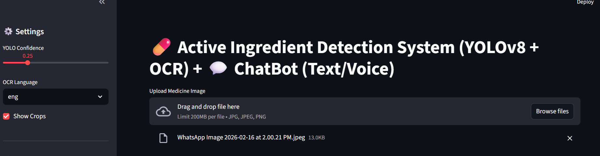
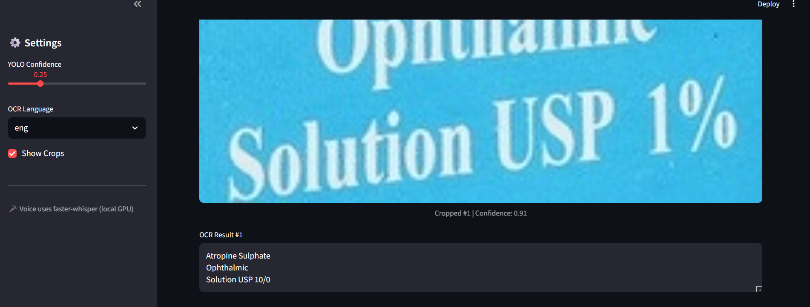
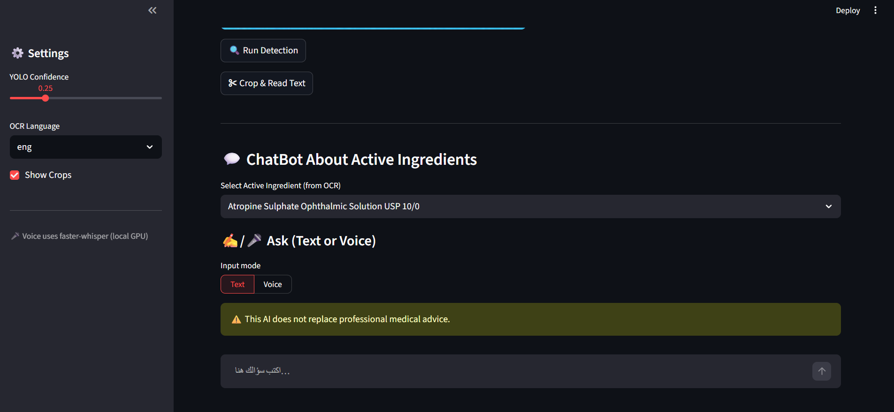

# 💊 Active Ingredient Detection System

### YOLOv8 + OCR + ChatBot (Text & Voice)

An end-to-end AI-powered system for detecting and extracting **active ingredients** from medicine images using **YOLOv8** and **OCR**, enhanced with an intelligent **chatbot** that supports both **text and voice interaction**.

---

## 🚀 Overview

This project automates the process of reading and understanding medicine labels by:

1. 📸 Uploading a medicine image
2. 🎯 Detecting text regions using **YOLOv8**
3. ✂️ Cropping relevant areas
4. 🔍 Extracting text using **OCR**
5. 💬 Allowing users to ask questions about the detected ingredient via chatbot

---

## ✨ Features

* 🧠 **YOLOv8-based detection** of active ingredient regions
* 🔍 **OCR text extraction** from detected areas
* ✂️ Automatic cropping of detected regions
* 🎛 Adjustable YOLO confidence slider
* 🌍 Multi-language OCR support
* 💬 Chatbot (Text + Voice input using Whisper)
* ⚡ Fast and interactive UI using **Streamlit**
* ⚠️ Built-in medical disclaimer
* 📸 Visual preview of cropped results

---

## 🖥️ Demo Screenshots

### 🏠 Home Interface



### 🔍 OCR Result



### 💬 ChatBot Interface



---

## 🧩 Project Workflow

```text
Image Upload → YOLO Detection → Crop → OCR → ChatBot Interaction
```

---

## 🛠️ Tech Stack

* Python
* Streamlit
* YOLOv8 (Ultralytics)
* OpenCV
* Pillow
* PyTorch
* Transformers
* Faster-Whisper
* NumPy

---

## 📁 Project Structure

```bash
OCR_YOLO_Project/
│
├── app.py
├── test.py
├── test_deepseek.py
├── download_whisper.py
├── requirements.txt
├── .env
│
├── assets/                # UI screenshots
│   ├── home.png
│   ├── ocr-result.png
│   └── chatbot.png
│
├── models/
│   └── deepseek_ocr/      # ❌ Not included (large files)
│
├── medicine.v3i.yolov8/
│   ├── train/
│   ├── valid/
│   ├── test/
│   └── data.yaml
│
├── output_deepseek_crop/
├── runs/
└── README.md
```

---

## ⚙️ Installation

```bash
git clone https://github.com/Rawan-khaled-AI/OCR_YOLO_Project.git
cd OCR_YOLO_Project
pip install -r requirements.txt
```

---

## ▶️ Run the App

```bash
streamlit run app.py
```

---

## 📦 Model Download

Due to size limitations, model files are not included in this repository.

You can download the model using:

```python
from huggingface_hub import snapshot_download

snapshot_download(
    repo_id="deepseek-ai/deepseek-ocr",
    local_dir="models/deepseek_ocr"
)
```

---

## 🎯 Use Cases

* Reading medicine labels
* Extracting active ingredients automatically
* Assisting in medical packaging analysis
* OCR-based healthcare applications
* Voice-enabled accessibility tools

---

## ⚠️ Disclaimer

> This system is intended for educational and research purposes only.
> It does NOT replace professional medical advice.

---

## 🔮 Future Improvements

* Arabic OCR support 🇪🇬
* Better handling of low-quality images
* Integration with medical databases
* Multi-label detection
* Cloud deployment (Streamlit / HuggingFace)

---

## 👩‍💻 Author

**Rawan Khaled**
AI & Computer Vision Engineer

---

## 🌐 Repository

👉 https://github.com/Rawan-khaled-AI/OCR_YOLO_Project

---

## ⭐ If you like this project, give it a star!

